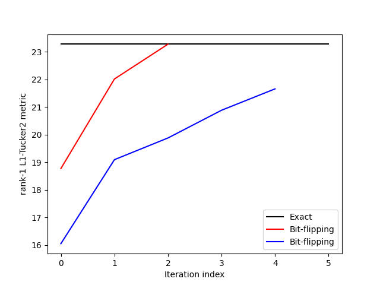

## Novel-algorithms-for-exact-and-efficient-L1-norm-based-Tucker2-decomposition
 
 We implement algorithms for solving rank-1 L1-norm Tucker2 decompostion of 3-ways tensors --both exactly and approximately-- as presented in [[1]](https://ieeexplore.ieee.org/document/8461839). 
Given a collection of matrix measurements, the scripts provided solve both exactly and approximately the following problem:


Moreover, in view of the approximate solver of [[1]](https://ieeexplore.ieee.org/document/8461839) and following the standard subspace-deflation approach, we offer a script for approxating a solution to 


---


IEEEXplore: https://ieeexplore.ieee.org/document/8461839

---
**Examples**

We form 3-way tensor of 10 10-by-10 matrix measurements.
```python
import numpy as np
import algorithms as l1tucker2
import matplotlib.pyplot as plt
from utils import *
# Form 3-way tensor of 10 10-by-10 matrix measurements. 
D, M, N = 10, 10, 10
tensor = np.random.randn(D, M, N)
```
Exact solution to rank-1 L1-Tucker2 by exhaustive search.
```python
# Solve rank-1 L1-Tucker2 exactly, by exhaustive search. 
uopt_exact, vopt_exact, bopt_exact, metopt_exact, numOfCandidates0 = l1tucker2.exact(tensor)
```

Approximate solution without user-defined initialization.
```python
# Approximate the solution to rank-1 L1-Tucker2 by bit-flipping iterations without user-defined initialization
uest1, vest1, best1, evolution1 = l1tucker2.bitflipping(tensor)
```
Approximate solution with user-defined initialization.

```python
# Approximate the solution to rank-1 L1-Tucker2 by bit-flipping iterations with user-defined initialization
b = np.sign(np.random.randn(N, ))
uest2, vest2, best2, evolution2 = l1tucker2.bitflipping(tensor, b)
```
Plot the results and compare the exact and approximate solutions with respect to the metric of the objective.
```python
# Plot the metric evolution (include the maximum attainable metric as a benchmark)
xax_max = np.max([len(evolution1), len(evolution2)])
plt.figure()
plt.plot([0, xax_max], [metopt_exact, metopt_exact], '-k', label = 'Exact')
plt.plot(evolution1, '-r', label = 'Bit-flipping')
plt.plot(evolution2, '-b', label = 'Bit-flipping')
plt.legend()
plt.xlabel('Iteration index')
plt.ylabel('rank-1 L1-Tucker2 metric')
plt.show()
```
For instance:



Finally, we can extract multiple components by means of standard defltation.
```python
# Extract multiple components by rank-1 BF-Tucker2 and defltation
number_of_components = 3
left_factor, right_factor = l1tucker2.bitflipping_deflation(tensor, number_of_components)
```

---
**Questions/issues**

Inquiries regarding the provided scripts are cordially welcome. In case you spot a bug, please let me know. If you use some piece of code for your own work, please cite the article above.

---
**Citing**

If you use our algorihtms for your own work, please cite [[1]](https://ieeexplore.ieee.org/document/8461839).
```bibtex
@INPROCEEDINGS{8461839,
  author={D. G. {Chachlakis} and P. P. {Markopoulos}},
  booktitle={2018 IEEE International Conference on Acoustics, Speech and Signal Processing (ICASSP)}, 
  title={Novel Algorithms for Exact and Efficient L1-NORM-BASED Tucker2 Decomposition}, 
  year={2018},
  volume={},
  number={},
  pages={6294-6298},
  doi={10.1109/ICASSP.2018.8461839}}
```
|[[1]](https://ieeexplore.ieee.org/document/8461839)|D. G. Chachlakis and P. P. Markopoulos, "Novel Algorithms for Exact and Efficient L1-NORM-BASED Tucker2 Decomposition," 2018 IEEE International Conference on Acoustics, Speech and Signal Processing (ICASSP), Calgary, AB, 2018, pp. 6294-6298, doi: 10.1109/ICASSP.2018.8461839.|
|-----|--------|

---
**Related works**

The following works might be of interest:

* [[2]](https://ieeexplore.ieee.org/document/8910610) D. G. Chachlakis, A. Prater-Bennette and P. P. Markopoulos, "L1-Norm Tucker Tensor Decomposition," in IEEE Access, vol. 7, pp. 178454-178465, 2019, doi: 10.1109/ACCESS.2019.2955134.

* [[3]](https://ieeexplore.ieee.org/document/8646385) P. P. Markopoulos, D. G. Chachlakis and A. Prater-Bennette, ``L1-NORM HIGHER-ORDER SINGULAR-VALUE DECOMPOSITION," 2018 IEEE Global Conference on Signal and Information Processing (GlobalSIP), Anaheim, CA, USA, 2018, pp. 1353-1357, doi: 10.1109/GlobalSIP.2018.8646385.


* [[4]](https://ieeexplore.ieee.org/document/9053701) D. G. Chachlakis, A. Prater-Bennette and P. P. Markopoulos, ``L1-Norm Higher-Order Orthogonal Iterations for Robust Tensor Analysis," ICASSP 2020 - 2020 IEEE International Conference on Acoustics, Speech and Signal Processing (ICASSP), Barcelona, Spain, 2020, pp. 4826-4830, doi: 10.1109/ICASSP40776.2020.9053701.


* [[5]](https://ieeexplore.ieee.org/document/8248754) P. P. Markopoulos, D. G. Chachlakis and E. E. Papalexakis, ``The Exact Solution to Rank-1 L1-Norm TUCKER2 Decomposition," in IEEE Signal Processing Letters, vol. 25, no. 4, pp. 511-515, April 2018, doi: 10.1109/LSP.2018.2790901.

* [[6]](https://doi.org/10.1117/12.2307843) D. G. Chachlakis and P. P. Markopoulos, ``Robust decomposition of 3-way tensors based on L1-norm,” in Proc. SPIE
Def. Comm. Sens., Orlando, FL, Apr. 2018, pp. 1065807:1–
1065807:15.

* [[7]](https://doi-org.ezproxy.rit.edu/10.1117/12.2520140) Dimitris G. Chachlakis, Mayur Dhanaraj, Ashley Prater-Bennette, Panos P. Markopoulos, ``Options for multimodal classification based on L1-Tucker decomposition," Proc. SPIE 10989, Big Data: Learning, Analytics, and Applications, 109890O (13 May 2019).

---
